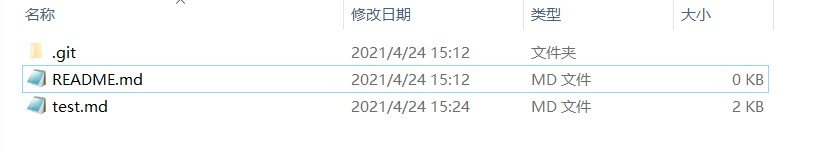

## 二级标题
#### 四级标题  

[百度](https://www.baidu.com)  

<file:///D:/test/engfolder/README.md>  

  

  

```python
  print("hello)
```  
> 我
> > 很
> > > 帅  

* 超
* 级
* 帅  

1. 无
2. 敌
3. 帅  

|  表头   | 表头  |
|  ----  | ----  |
| 单元格  | 单元格 |
| 单元格  | 单元格 |  

**粗体文本**  

*斜体文本*  

~~like this~~  

* a horizontal rule like the one that follows this list.